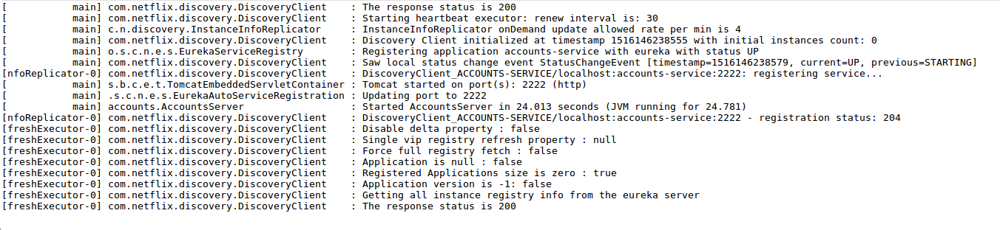
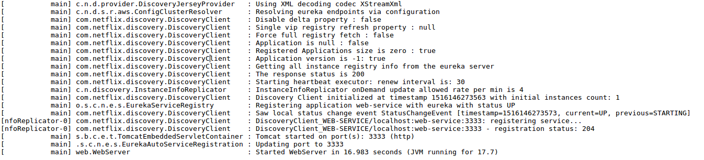
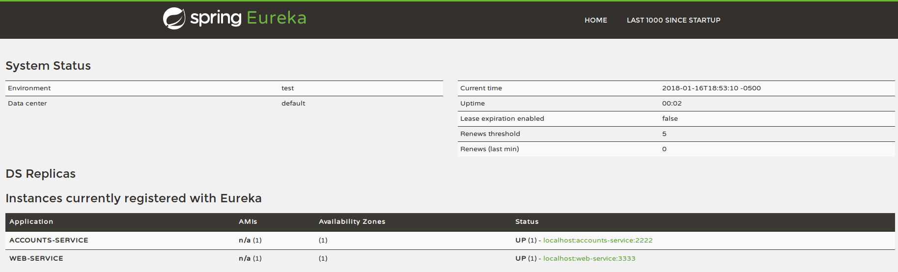
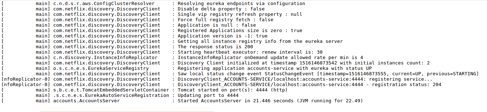
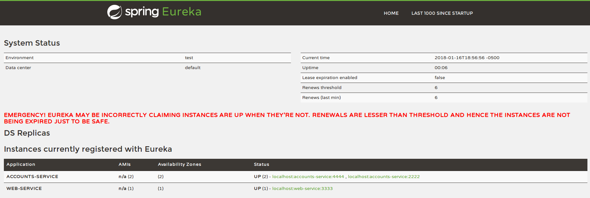

# Web Engineering 2017-2018 / Microservices

## Report

**1. The two microservices are running and registered**

*Account Service*

*Web Service*

**2. The service registration service has the two microservices registered**

*Registration Service*

**3. A second account microservice is running in the port 4444 and it is registered**

*Account Service runs in the port 4444*

*Registration Service 2*

**4. A brief report describing what happens when you kill the microservice with port 2222. Can the web service provide information about the accounts? Why?**

When we kill the Account microservice which is running in the port 2222, the Web microservice cannot provide information at this moment, because he is still trying to connect to that port.
Nevertheless, a short time after this break Eureka takes notice of this, all petitions will be redirect to the other microservice which is running in the port 4444 and Web microservice can
provide now information about the accounts.

